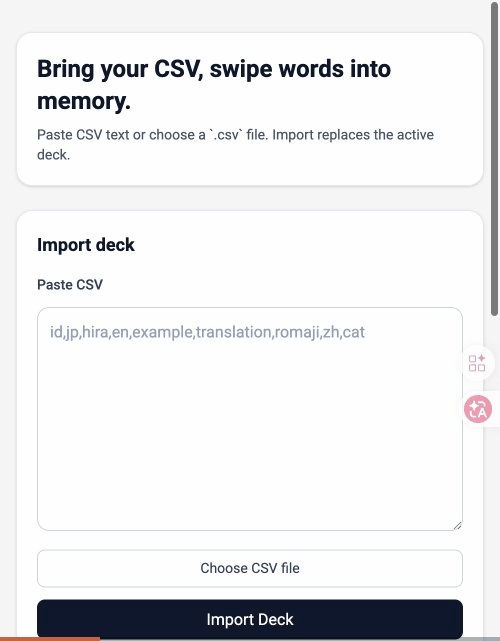
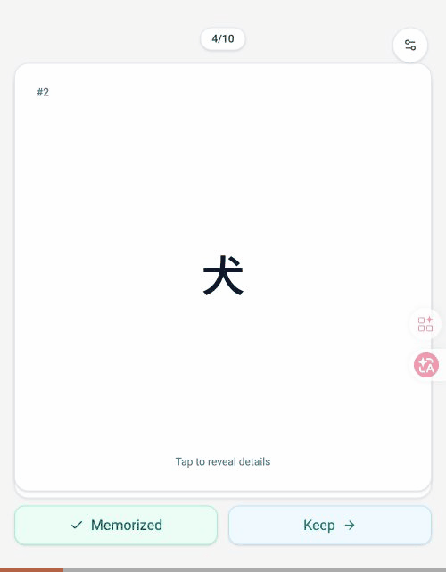

# Meet Vocab

Ask any LLM for Japanese words. Swipe to memorize them.

No account. No backend. Everything stays in your browser.

<p align="center">
  
  &nbsp;&nbsp;&nbsp;
  
</p>

## Making Your Deck

The app has a built-in prompt helper. Pick a topic, set how many words you want, copy the prompt, paste it into ChatGPT / Claude / Gemini / whatever you use.

Here's the prompt template — just change the last line:

```
Generate a Japanese vocabulary CSV for language learning.

Output ONLY raw CSV — no markdown fences, no explanation, no commentary.

Header (recommended order):
id,jp,hira,en,example,translation,romaji,zh,cat

Column definitions:
- id: unique integer starting from 1
- jp: Japanese word in standard form (kanji where appropriate)
- hira: full hiragana reading
- en: English meaning
- example: example sentence in Japanese using the word
- translation: English translation of the example sentence
- romaji: romanized pronunciation (optional, may be empty)
- zh: Chinese meaning (optional, may be empty)
- cat: category like "noun", "verb", "adjective" (optional, may be empty)

Rules:
- Use standard CSV quoting if a field contains commas.
- Every row must have id, jp, hira, en, example, and translation filled.
- Generate 5 words about animals.
```

Your LLM will return something like:

```csv
id,jp,hira,en,example,translation,romaji,zh,cat
1,猫,ねこ,cat,猫が好きです,I like cats,neko,猫,noun
2,犬,いぬ,dog,犬と散歩します,I walk with my dog,inu,狗,noun
3,鳥,とり,bird,鳥が空を飛んでいます,A bird is flying in the sky,tori,鸟,noun
4,魚,さかな,fish,魚を食べました,I ate fish,sakana,鱼,noun
5,馬,うま,horse,馬に乗りたいです,I want to ride a horse,uma,马,noun
```

Paste that into the app and you're studying.

## Options

- **Front mode** — Show Japanese or English on the front of the card
- **Hide memorized** — Memorized cards leave the deck (on by default)
- **Re-shuffle / Restart / Reset** — Remix the deck however you want
- **Import new deck** — Swap in a different set of words anytime

## Development

```sh
npm install && npm run dev
```

## Hosting (GitHub Pages)

- Repo: `git@github.com:favrei/meet_vocab.git`
- Production URL: `https://favrei.github.io/meet_vocab/`
- Deploy: push to `main` (workflow: `.github/workflows/deploy.yml`)
